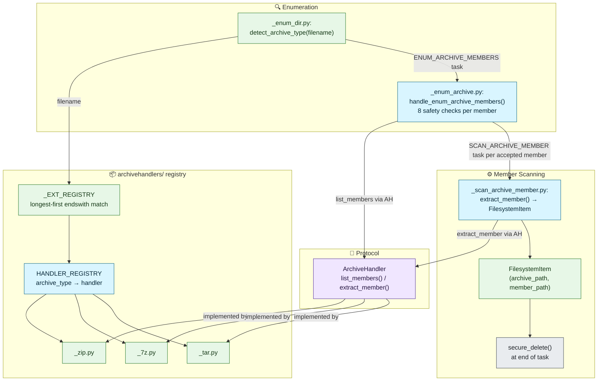

# Archive Handling

## Overview

### Purpose
PIIDigger scans inside archive files without the caller extracting them first. One `ArchiveHandler` protocol and a small format registry make this work the same way regardless of archive type.

### Context
This is the design companion to [docs/user-guides/archive-handling.md](../../user-guides/archive-handling.md), which explains the on-disk behavior and security implications for end users. This document covers the contributor/maintainer view: the protocol, the registry, and how a new format gets added.

### Status
Active now. Three formats are implemented and tested: zip, 7z, and tar (including its gzip/bzip2/xz-compressed variants).

### Scope
This document does not repeat the coordinator/worker mechanics — see [Coordinator/Worker Task Pipeline](../orchestration/coordinator-worker-pipeline.md) for how `ENUM_ARCHIVE_MEMBERS` and `SCAN_ARCHIVE_MEMBER` fit into task dispatch generally. It does not repeat end-user security guidance — see the user guide linked above.

## Architectural Principles

### Design Goals
- **Format-agnostic dispatch**: `coordinator.py` and `worker/_loop.py` know nothing about zip, 7z, or tar — they only see `ENUM_ARCHIVE_MEMBERS`/`SCAN_ARCHIVE_MEMBER` tasks and an `archive_type` string in the payload.
- **One module per format, self-declaring what it handles**: each `archivehandlers/_*.py` module declares `ARCHIVE_TYPE` and `HANDLES = {"ext": [...]}` rather than the routing logic hardcoding a format list.
- **No separate "archive member" content type**: `FilesystemItem` represents both a plain file and an extracted archive member. Downstream file handlers and data handlers never know or care which one they're reading.
- **Defense in depth on extraction**: safety checks run twice — once at enumeration time (reject before a task is even created) and once at extraction time (format-specific extraction filters, e.g. tarfile's `filter="data"`).

### Key Benefits
- **Adding an additional format touches one new module and one registry line** — no coordinator, worker-loop, or protocol changes (proven in practice: this is exactly how `tar` was added after `zip`/`7z`).
- **Compound extensions don't need special-casing in the caller**: `detect_archive_type()` handles `.tar.gz`/`.tgz` the same way it handles `.zip`, because extension recognition is the archive module's own declared data, not a hardcoded `Path.suffix` lookup.
- **Extracted content never lingers**: every extracted member is deleted (via `secure_delete()`) at the end of the task that used it, whether the task succeeded or failed.

## Architecture Diagram

## Protocols

[protocols.py](../../../src/piidigger/protocols.py) defines `ArchiveHandler` with exactly two methods:

::: piidigger.protocols.ArchiveHandler
    options:
      show_root_heading: true
      members_order: source

`MemberInfo` is the format-neutral result of `list_members()`. `ArchiveReadError` is the one exception type every format module normalizes its library-specific errors (`BadZipFile`, `py7zr` exceptions, `tarfile.TarError`) into, so callers stay format-agnostic.

::: piidigger.models.archive.MemberInfo
    options:
      show_root_heading: true
      members_order: source

::: piidigger.exceptions.ArchiveReadError
    options:
      show_root_heading: true

## Core Implementation

### The registry — [archivehandlers/\_\_init\_\_.py](../../../src/piidigger/archivehandlers/__init__.py)
Two lookup structures are built once, from each module's self-declared data:

- `HANDLER_REGISTRY: dict[str, ArchiveHandler]` — maps `archive_type` (`"zip"`, `"7z"`, `"tar"`) to a handler instance. Used by worker handlers that already know the type (it travels in the task payload).
- `_EXT_REGISTRY` / `detect_archive_type(filename)` — a tuple of `(extension, archive_type)` pairs sorted longest-first, matched by `endswith()`. This exists because tar's compound suffixes (`.tar.gz`, `.tgz`) don't fit a `Path.suffix`-based exact-match lookup the way single-suffix formats do: `Path("data.tar.gz").suffix` is `".gz"`, not `".tar.gz"`. Longest-first ordering guarantees `"tar.gz"` is tried before a shorter `"gz"` would be, so a plain `.gz` log file is never misdetected as tar (there's no bare `"gz"` entry in the registry at all — only compound tar variants and single-suffix zip/7z).

### Format modules
Each module in `archivehandlers/` declares `ARCHIVE_TYPE: str` and `HANDLES = {"ext": [...]}`, then implements the two protocol methods:

| Module | Library | Notes |
|---|---|---|
| `_zip.py` | stdlib `zipfile` | Per-member encryption flag (`ZipInfo.flag_bits & 0x1`); flat extraction (`dest_dir / Path(member_path).name`); Unix symlink entries excluded via `create_system`/`external_attr` inspection. |
| `_7z.py` | `py7zr` (lazy-imported — only loaded when a `.7z` file is actually encountered) | Encryption is archive-level, not per-member (`szf.needs_password()` applies to every member); symlink entries excluded via `info.is_symlink`. |
| `_tar.py` | stdlib `tarfile` | `mode="r:*"` transparently detects gzip/bzip2/xz/no compression — the handler never inspects the filename. No per-member `compressed_size` (tar is a sequential container; the bomb-ratio check below is a no-op for tar, same as it already is for solid 7z archives). No native encryption concept. Symlinks, hardlinks, and device/FIFO members are excluded in `list_members()` — they have no scannable content and would either dangle or resolve outside `dest_dir` if extracted in isolation. Extraction uses `filter="data"` (PEP 706's security-hardened mode) as a second, independent safety layer beyond the enumeration-time path-traversal check. |

`temp_base` is the per-run scratch root on [`WorkerContext`](../../../src/piidigger/orchestration/context.py): `run_scan()` creates it once per scan (`Path(tempfile.mkdtemp(prefix="piidigger_"))`) and adds it to `exclude_dirs` so `ENUM_DIR` never wanders into it. Every task gets its own subdirectory under that root, `task_temp = temp_base / task.task_id`, computed on demand from the worker's `ctx.temp_base` and the current `task_id` rather than stored anywhere — `_scan_archive_member.py` passes it as `dest_dir` to `extract_member()`, and `_cleanup_temp_workspace()` derives the same path to delete it afterward.

None of the three format modules use `tempfile.TemporaryDirectory()` — extraction always writes into that per-task `task_temp` directory, which `_cleanup_temp_workspace()` securely deletes as a whole after the task finishes (recursively, so a handler is free to extract into a subdirectory rather than needing to flatten paths itself).

### Enumeration safety checks — `handle_enum_archive_members()`
[orchestration/worker/_enum_archive.py](../../../src/piidigger/orchestration/worker/_enum_archive.py) applies, per member, in order: (1) member count limit, (2) path traversal (`../` or absolute), (3) encryption flag, (4) individual uncompressed-size limit, (5) compression-ratio bomb heuristic (skipped when `compressed_size == 0`, which is always true for tar and solid 7z), (6) running total uncompressed-size limit, (7) nested archive (deferred — skipped for now), (8) no registered `FileHandler` for the member's extension. Only members passing every check produce a `SCAN_ARCHIVE_MEMBER` task.

### `ArchiveConfig`

::: piidigger.models.config.ArchiveConfig
    options:
      show_root_heading: true
      members_order: source

`formats` defaults to `["all"]`, which expands to every key currently in `HANDLER_REGISTRY` rather than a hardcoded format list — so `formats: ["tar"]` (or `"all"`) enables every tar compression flavor together; flavors are not independently toggleable, matching how `zip`/`7z` are single on/off switches.

## Extension Points

To add a fourth archive format:

1. Create `archivehandlers/_newformat.py` implementing `ArchiveHandler` (`list_members()`, `extract_member()`), declaring `ARCHIVE_TYPE = "newformat"` and `HANDLES = {"ext": [...]}`.
2. Add the module to `_MODULES` in `archivehandlers/__init__.py` — `HANDLER_REGISTRY` and `_EXT_REGISTRY` are built from that tuple automatically.
3. Nothing else changes: `coordinator.py`, `worker/_loop.py`'s `DISPATCH`, `_enum_archive.py`'s safety-check loop, `protocols.py`, and `models/archive.py` are all already format-agnostic. This is the same claim the tar addition proved in practice — its own implementation touched only the new module, the registry, and (for the compound-extension case specifically) `_enum_dir.py`'s detection call site.

## Performance Considerations

- **Bomb defense without per-member compressed size**: for tar and solid 7z archives, `compressed_size` is reported as `0`, which disables the ratio check (check 5) for those members — `max_total_uncompressed_size_mb` and `max_members` are the primary defenses in that case, not a gap introduced by any one format.
- **Lazy `py7zr` import**: `_7z.py` only imports `py7zr` inside its methods, so processes that never encounter a `.7z` file never pay that import cost.
- **Recursive, whole-tree cleanup**: `_cleanup_temp_workspace()` walks `task_temp` with `rglob("*")` and calls `shutil.rmtree()` once, rather than requiring every handler to flatten extracted paths to a single directory level.

## Testing Notes

See [tests/test_archives.py](../../../tests/test_archives.py) for the full suite — handler unit tests per format, `detect_archive_type()` tests (including compound-suffix and alias cases), and end-to-end enum/scan integration tests. See [Testing Requirements](../quality/testing-requirements.md) for the project-wide standard.

## Cross-References

- [docs/user-guides/archive-handling.md](../../user-guides/archive-handling.md) — end-user/security-facing: what happens on disk, secure deletion, residual-data risk.
- [docs/refactor/ADR-multi-format-archives.md](../../refactor/ADR-multi-format-archives.md) — historical design rationale for the zip/7z registry pattern and the `extract_member()`-only protocol revision. Implemented.
- [docs/refactor/TAR_HANDLING_PLAN.md](../../refactor/TAR_HANDLING_PLAN.md) — historical design rationale for tar's compound-extension detection and format-specific decisions. Implemented.
- [Coordinator/Worker Task Pipeline](../orchestration/coordinator-worker-pipeline.md) — how `ENUM_ARCHIVE_MEMBERS`/`SCAN_ARCHIVE_MEMBER` fit into task dispatch generally.
