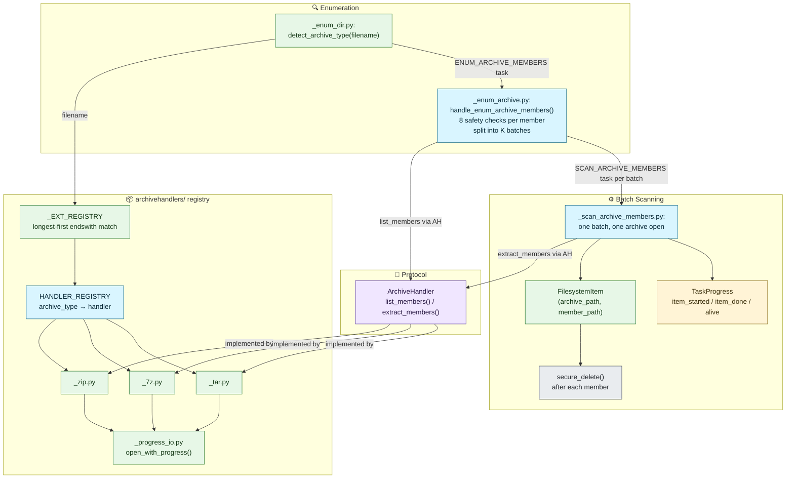

# Archive Handling

## Overview

### Purpose
PIIDigger scans inside archive files without the caller extracting them first. One `ArchiveHandler` protocol and a small format registry make this work the same way regardless of archive type.

### Context
This is the design companion to [docs/user-guides/archive-handling.md](../../user-guides/archive-handling.md), which explains the on-disk behavior and security implications for end users. This document covers the contributor/maintainer view: the protocol, the registry, how archives are split into scan tasks, and the trade-offs behind that split.

### Status
Active now. Three formats are implemented and tested: zip, 7z, and tar (including its gzip/bzip2/xz-compressed variants).

### Scope
This document does not repeat the coordinator/worker mechanics — see [Coordinator/Worker Task Pipeline](../orchestration/coordinator-worker-pipeline.md) for task dispatch, `TaskProgress`, and the health sweeps. It does not repeat end-user security guidance — see the user guide linked above.

## Architectural Principles

### Design Goals
- **Format-agnostic dispatch**: `coordinator.py` and `worker/_loop.py` know nothing about zip, 7z, or tar. They only see `ENUM_ARCHIVE_MEMBERS`/`SCAN_ARCHIVE_MEMBERS` tasks and an `archive_type` string in the payload.
- **Enumerate, then scan**: enumeration decides *what* is scanned, applying every safety check. Separate tasks do the scanning. This matches how `ENUM_DIR` and `SCAN_FILE` divide filesystem work.
- **Decompression stays linear in archive size**: a scan task covers a contiguous run of members, so it decompresses the archive prefix once per run, not once per member.
- **One member on disk per worker**: a member is extracted, scanned, and securely deleted before the next one is extracted. PIIDigger never unpacks an archive to disk up front.
- **Defense in depth on extraction**: safety checks run twice — once at enumeration time (reject before a task is even created) and once at extraction time (format-specific extraction filters, e.g. tarfile's `filter="data"`).

### Key Benefits
- **Adding a format touches one new module and one registry line** — no coordinator, worker-loop, or protocol changes.
- **Compound extensions need no special case in the caller**: `detect_archive_type()` handles `.tar.gz`/`.tgz` the same way it handles `.zip`, because each archive module declares its own extensions.
- **A bad member costs only itself**: findings stream back member by member, and a member that hangs or crashes its worker is dropped while the rest of its batch is requeued.
- **Extracted content never lingers**: every extracted member is deleted with `secure_delete()` before the next is extracted, and the task's temp directory is securely removed when the task ends.

## Architecture Diagram

```mermaid
flowchart TB
    subgraph enum_group["🔍 Enumeration"]
        ENUMDIR["_enum_dir.py:\ndetect_archive_type(filename)"]:::component
        ENUMARCHIVE["_enum_archive.py:\nhandle_enum_archive_members()\n8 safety checks per member\nsplit into K batches"]:::coreService
    end

    subgraph registry_group["📦 archivehandlers/ registry"]
        REGISTRY["HANDLER_REGISTRY\narchive_type → handler"]:::coreService
        EXTREG["_EXT_REGISTRY\nlongest-first endswith match"]:::component
        ZIP["_zip.py"]:::component
        SEVENZ["_7z.py"]:::component
        TAR["_tar.py"]:::component
        PIO["_progress_io.py\nopen_with_progress()"]:::component
    end

    subgraph protocol_group["📐 Protocol"]
        AH["ArchiveHandler\nlist_members() / extract_members()"]:::protocol
    end

    subgraph scan_group["⚙️ Batch Scanning"]
        SCANBATCH["_scan_archive_members.py:\none batch, one archive open"]:::coreService
        FSITEM["FilesystemItem\n(archive_path, member_path)"]:::component
        CLEANUP["secure_delete()\nafter each member"]:::storage
        PROGRESS["TaskProgress\nitem_started / item_done / alive"]:::integration
    end

    ENUMDIR -->|filename| EXTREG
    EXTREG --> REGISTRY
    REGISTRY --> ZIP
    REGISTRY --> SEVENZ
    REGISTRY --> TAR
    AH -->|implemented by| ZIP
    AH -->|implemented by| SEVENZ
    AH -->|implemented by| TAR
    ZIP --> PIO
    SEVENZ --> PIO
    TAR --> PIO
    ENUMDIR -->|ENUM_ARCHIVE_MEMBERS task| ENUMARCHIVE
    ENUMARCHIVE -->|list_members via AH| AH
    ENUMARCHIVE -->|SCAN_ARCHIVE_MEMBERS task per batch| SCANBATCH
    SCANBATCH -->|extract_members via AH| AH
    SCANBATCH --> FSITEM
    FSITEM --> CLEANUP
    SCANBATCH --> PROGRESS

    classDef coreService fill:#d9f5ff,stroke:#176b87,stroke-width:1px,color:#062635
    classDef protocol fill:#f0e6ff,stroke:#5b3a9e,stroke-width:1px,color:#24143f
    classDef component fill:#e7f7e7,stroke:#2f7d32,stroke-width:1px,color:#163917
    classDef integration fill:#fff4d6,stroke:#8a6d1a,stroke-width:1px,color:#3a2e0a
    classDef storage fill:#e9ecef,stroke:#495057,stroke-width:1px,color:#1f2328
```

## Protocols

[protocols.py](../../../src/piidigger/protocols.py) defines `ArchiveHandler` with two methods:

::: piidigger.protocols.ArchiveHandler
    options:
      show_root_heading: true
      members_order: source

`extract_members()` is push-based: it calls back into the caller for each member, and does not move on until the callback returns. That fits py7zr, which writes members through callbacks, and needs no threads. The callbacks are plain callables, so handlers never import multiprocessing, a queue, or a logger.

`MemberInfo` is the format-neutral result of `list_members()`. `ArchiveReadError` is the one exception type every format module normalizes its library-specific errors (`BadZipFile`, `py7zr` exceptions, `tarfile.TarError`) into, so callers stay format-agnostic.

::: piidigger.models.archive.MemberInfo
    options:
      show_root_heading: true
      members_order: source

::: piidigger.exceptions.ArchiveReadError
    options:
      show_root_heading: true

## Core Implementation

### The registry — [archivehandlers/\_\_init\_\_.py](../../../src/piidigger/archivehandlers/__init__.py)
Two lookup structures are built once, from each module's self-declared data:

- `HANDLER_REGISTRY: dict[str, ArchiveHandler]` — maps `archive_type` (`"zip"`, `"7z"`, `"tar"`) to a handler instance. Used by worker handlers that already know the type (it travels in the task payload).
- `_EXT_REGISTRY` / `detect_archive_type(filename)` — a tuple of `(extension, archive_type)` pairs sorted longest-first, matched by `endswith()`. This exists because tar's compound suffixes (`.tar.gz`, `.tgz`) don't fit a `Path.suffix` lookup: `Path("data.tar.gz").suffix` is `".gz"`. Longest-first ordering means `"tar.gz"` is tried before any shorter suffix. There is no bare `"gz"` entry, so a plain `.gz` log file is never misdetected as tar.

### Format modules
Each module in `archivehandlers/` declares `ARCHIVE_TYPE: str` and `HANDLES = {"ext": [...]}`, then implements the two protocol methods. All three read the archive through `open_with_progress()` ([_progress_io.py](../../../src/piidigger/archivehandlers/_progress_io.py)), a buffered file whose every disk read calls `on_progress`.

| Module | Library | Notes |
|---|---|---|
| `_zip.py` | stdlib `zipfile` | Random access: any member is read directly, so `decompress_offset` is always 0. Per-member encryption flag (`ZipInfo.flag_bits & 0x1`). Flat extraction (`dest_dir / Path(member_path).name`), safe because each member is deleted before the next is written. A CRC or decompression error, or an OS refusal to write the member's file, spoils only that member and goes to `on_failed`. When a name occurs twice, the first entry is extracted — the one enumeration checked. Unix symlink entries are excluded via `create_system`/`external_attr`. |
| `_7z.py` | `py7zr` (lazy-imported — only loaded when a `.7z` file is actually read) | Members are written through `_ScanWriterFactory`, which calls `on_extracted` from the writer's `close()`. py7zr calls `close()` only after a member passes its CRC check and before it starts the next. The archive is passed as an open file, not a path, which keeps py7zr on one thread. Encryption is archive-level (`szf.needs_password()`). A member whose file the OS refuses to create goes to `on_failed`, and its data is discarded. A CRC error ends the whole run, because nothing after a corrupt member in a solid folder can be decoded. |
| `_tar.py` | stdlib `tarfile` | `mode="r:*"` detects gzip/bzip2/xz/no compression. Extraction walks forward with `next()` and stops after the last requested member. It never uses `getmember()`, which reads every header to the end of the archive and then seeks back, making a compressed reader restart from byte 0. No per-member `compressed_size` and no native encryption. Symlinks, hardlinks, and device/FIFO members are excluded in `list_members()`. Extraction uses `filter="data"` (PEP 706) as a second safety layer behind the enumeration-time path check. The path handed to `on_extracted` comes from the member as the filter rewrites it, never from the raw name: on Windows the filter strips a leading backslash, and the raw name would point at the drive root. A member the filter rejects, or the OS refuses to write, goes to `on_failed`. An uncompressed tar reports `decompress_offset` 0, because it seeks past member data for free. |

`temp_base` is the per-run scratch root on [`WorkerContext`](../../../src/piidigger/orchestration/context.py). `run_scan()` creates it once per scan and adds it to `exclude_dirs` so `ENUM_DIR` never wanders into it. Every task run gets its own subdirectory, `task_temp = ctx.task_workspace(task.task_id)`, which is `temp_base/<task_id>-<pid>`. The pid matters because task ids are reused across retries. The lost-task sweep can re-dispatch a batch whose first worker is only slow, and two live workers must not extract into one folder. `_scan_archive_members.py` passes it as `dest_dir` to `extract_members()`, and `_cleanup_temp_workspace()` securely removes the same directory when the task ends. Cleanup never raises. A file it cannot remove yet, such as one an antivirus scanner holds open on Windows, is logged and left for the run-level `secure_rmtree(temp_base)`. That final pass retries for a few seconds and prints a warning on stderr naming the folder if anything is still left. Secure deletion is best effort. `secure_rmtree()` never raises, reports every path it could not remove, and never unlinks a file it has not overwritten. A folder it cannot list is left in place and reported.

### Enumeration — `handle_enum_archive_members()`
[orchestration/worker/_enum_archive.py](../../../src/piidigger/orchestration/worker/_enum_archive.py) applies, per member, in order:

1. Member count limit
2. Path traversal (`../` or absolute)
3. Encryption flag
4. Individual uncompressed-size limit
5. Compression-ratio bomb heuristic (skipped when `compressed_size == 0`, which is always true for tar and solid 7z)
6. Running total uncompressed-size limit, and the **traversal cap** (below)
7. Nested archive (deferred — skipped for now)
8. `include_exts` and a registered `FileHandler` for the member's extension, through `filehandlers.select_handler()` — the same rule `ENUM_DIR` applies to files on disk. Extensions match regardless of case. Members are never MIME-detected, so a member with no or an unrecognized extension is not scanned. Members skipped here are reported in one INFO line per archive, grouped by extension.

A path that appears twice in one archive (`tar -r` appends) is enumerated once, at its first occurrence, because a batch names its members by path.

Check 2 normalises backslashes first, and also rejects names that start with a drive letter, so a name such as `\x\y.txt` or `C:x.txt` never reaches extraction.

**Traversal cap.** In a compressed tar or a solid 7z, reaching a member means decompressing every byte stored before it, skipped members included. `MemberInfo.decompress_offset` records that amount. Check 6 skips a member whose `decompress_offset + uncompressed_size` exceeds `max_total_uncompressed_size_mb`. So no scan task has to decompress an unbounded amount of data to reach a member, and no extra setting is needed. Zip and uncompressed tar report offset 0 and are unaffected.

Accepted members, in archive order, are then split into batches (below). Each batch becomes one `SCAN_ARCHIVE_MEMBERS` task whose `Task.items` lists its member paths.

### Batch scanning — `handle_scan_archive_members()`
[orchestration/worker/_scan_archive_members.py](../../../src/piidigger/orchestration/worker/_scan_archive_members.py) opens the archive once per batch and calls `extract_members()` for `task.items`. For each member it:

1. Sends `TaskProgress` `item_started`
2. Receives the extracted file in the `on_extracted` callback
3. Runs the file handler and data handlers, building one `ResultRecord` per matching data handler, with lineage fields (`source_member_path`, `source_depth`, `source_container_type`)
4. Calls `secure_delete()` on the file
5. Sends `item_done` with that member's findings and counters

`on_progress` sends rate-limited `alive` messages while compressed bytes are read, which covers long prefix skips. A member that fails on its own (no file handler, an extraction filter, an OS write error, a reader error) is reported done with a failure count, and the batch goes on. The callback scans and deletes only paths inside the task's own temp folder. A delete that fails (a handle left open, an antivirus lock) is logged; the file is removed with the task folder when the task ends.

When the archive itself cannot be read, the handler returns an error result. If that happened while a member was in progress, the coordinator counts only that member as failed and requeues the rest of the batch. If it happened before any member started, the archive is unreadable from that point on, and the remaining members are counted as failed.

If the worker hangs or dies, the coordinator drops the member that was in progress and requeues the rest of the batch, as described in [Coordinator/Worker Task Pipeline](../orchestration/coordinator-worker-pipeline.md#tasks-with-items).

### `ArchiveConfig`

::: piidigger.models.config.ArchiveConfig
    options:
      show_root_heading: true
      members_order: source

`formats` defaults to `["all"]`, which expands to every key currently in `HANDLER_REGISTRY` rather than a hardcoded format list. So `formats: ["tar"]` (or `"all"`) enables every tar compression flavor together; flavors are not independently toggleable, matching how `zip`/`7z` are single on/off switches.

## Batching: the trade-offs

### Why members are batched
Compressed tar and solid 7z store members in one compressed stream. A reader cannot jump to a member; it has to decompress everything before it. If every member were its own task, each task would decompress from the start of the archive. The total work then grows with the square of the member count -- O(n^2).

Scanning, not decompression, is the slow part of the work. So the design question is how to spread scanning across workers without decompressing the archive over and over.

### Terms
| Term | Meaning |
|---|---|
| **N** | Number of members scanned from one archive |
| **W** | Number of worker processes in the scan (`WorkerContext.n_workers`) |
| **K** | Number of batches (scan tasks) one archive's members are split into. K is at least W, so every worker gets a batch, and grows for archives larger than `W × max_batch_mb`. |
| **T_d** | Time to decompress the whole archive once, from start to end |
| **T_s** | Time to scan all the archive's content with the enabled data handlers |
| **R = T_s ÷ T_d** | How many times longer scanning the content takes than decompressing it |

R depends on the compression format, the content, the enabled data handlers, and the machine. For example, on a moderately equipped business laptop, with the pan and email handlers on JSON logs dense with card-like numbers:

| Compression | Decompression rate | R |
|---|---|---|
| gzip | about 420 MB/s | about 225 |
| xz / LZMA | about 47 MB/s | about 25 |
| 7z through py7zr | about 16 MB/s | about 8–10 |

Scanning ran at about 1.9 MB/s. Typical content scans faster than that test data, which lowers R. [testdata/archives/bench_member_access.py](../../../testdata/archives/bench_member_access.py) measures these figures on any machine.

### The cost of each choice
Any approach must decompress the archive once (T_d) and scan it (T_s = R × T_d). Scanning dominates, so wall-clock time depends on how many workers share it, ideally about T_s ÷ W.

| Choice | Extra decompression | Extra, as a share of scan time | Scanning shared by |
|---|---|---|---|
| One member per task (compressed tar) | about 1.2·N × T_d | 1.2·N ÷ R | W workers |
| One member per task (solid 7z) | about N/2 × T_d | N ÷ 2R | W workers |
| One task per archive (K = 1) | none | none | 1 worker |
| **K contiguous batches (chosen)** | about (K−1)/2 × T_d | (K−1) ÷ 2R | W workers |

One member per task fails as N grows: at N = 5,000 and R ≈ 200, decompression alone takes about 30 times as long as scanning. One task per archive wastes nothing but leaves W−1 workers idle on that archive.

Batching sits between them. Each batch skips the part of the archive before its first member once, then reads its own members in order. On average that prefix is half the archive, which gives (K−1)/2 extra passes in total. The prefix skips run on different workers at the same time, so they overlap in wall-clock time. Plain `.tar` and zip seek directly, so their prefix cost is close to zero.

### Choosing K
`batch_count()` picks `K = min(N, max(W, ⌈U ÷ max_batch_mb⌉))`, where U is the total uncompressed size of the accepted members. `split_into_batches()` then splits the members into K contiguous runs of similar total size, in archive order.

- **K ≥ W** keeps every worker scanning.
- **K ≤ N** means K never exceeds the number of tasks one-member-per-task would have created.
- **`max_batch_mb` (default 1024)** adds batches only for archives larger than `W × max_batch_mb`. A failure no longer costs a whole batch, because findings stream per member and a bad member is skipped. So the cap mainly limits how long one task runs. It is set high because each extra batch costs another partial decompression, and R is low for 7z: with R ≈ 9, eight batches add about 40% CPU, while thirty-two would add about 170%.

### Member order
Batches are contiguous only if `list_members()` returns members in the order their data is stored. This holds for every supported format:

- **tarfile** builds its member list by reading headers front to back, the same walk `next()` performs.
- **py7zr** assigns header entries to folders in order, keeps header order within a folder (the order the 7z format stores their data), and lays folders out in index order. Extraction walks folders by index and files in order, and `SevenZipFile.files` iterates the same list.
- **zip** lists members in central-directory order, which can differ from storage order. That costs nothing, because zip reads each member directly.

Correctness never depends on order. Progress comes from the library's own events, and the coordinator removes finished members by name, not by position. Order only affects cost.

### Concurrent reads of one archive
By default, W batches from one archive run at once. They do not block each other:

- **Read-only, no locks.** All three libraries open the archive read-only, and none takes a lock. On Windows, CPython's `open()` lets other processes read the same file.
- **Less I/O than per-member tasks.** K batches read the archive about (K+1)/2 times in total, against up to N times with one task per member.
- **A small read rate.** A worker reads only as fast as it decompresses during a prefix skip, and about R times slower while scanning.
- **A shared page cache.** Batches from one archive are queued together, so workers skip over the same bytes at about the same time. The first reader pulls each block into the OS file cache for the others, as long as the archive fits in free RAM.

A spinning disk or a slow network share can still lose some throughput when several workers read different parts of one file. If that shows up, the fix is a cap on how many batches from one archive run at once.

## Extension Points

To add a fourth archive format:

1. Create `archivehandlers/_newformat.py` implementing `ArchiveHandler` (`list_members()`, `extract_members()`), declaring `ARCHIVE_TYPE = "newformat"` and `HANDLES = {"ext": [...]}`.
   - Read the archive through `open_with_progress()` so long reads keep the task alive.
   - Return members from `list_members()` in storage order, with `decompress_offset` set to the uncompressed bytes a reader must get through to reach each one (0 for a random-access format).
   - In `extract_members()`, call `on_started`, then `on_extracted`, for one member at a time, and do not start the next until `on_extracted` returns.
2. Add the module to `_MODULES` in `archivehandlers/__init__.py`. `HANDLER_REGISTRY` and `_EXT_REGISTRY` are built from that tuple automatically.
3. Nothing else changes: `coordinator.py`, `worker/_loop.py`'s `DISPATCH`, `_enum_archive.py`'s safety checks and batching, `protocols.py`, and `models/archive.py` are format-agnostic.

## Performance Considerations

- **Batching** keeps decompression linear in archive size; see [Batching: the trade-offs](#batching-the-trade-offs).
- **Bomb defense without per-member compressed size**: tar and solid 7z report `compressed_size` as `0`, which disables the ratio check (check 5) for those members. `max_total_uncompressed_size_mb` (which also caps `decompress_offset`) and `max_members` are the primary defenses in that case.
- **Streaming extraction for zip**: each member is copied to disk in chunks instead of being read into memory whole.
- **Lazy `py7zr` import**: `_7z.py` only imports `py7zr` inside its methods, so processes that never encounter a `.7z` file never pay that import cost.

## Testing Notes

See [tests/test_archives.py](../../../tests/test_archives.py) for the full suite: handler unit tests per format, `extract_members()` order and one-file-on-disk checks for all three formats, `decompress_offset` values, batch-count and split math, the traversal cap, the 7z CRC failure path, and a regression test that bounds how many times K batches read a `.tar.gz`. The registry and health-sweep behavior for batches is tested in `tests/test_task_registry.py` and `tests/test_health_monitor.py`. A slow test in `tests/test_coordinator.py` drives a real scan in which one member outlasts the deadline. See [Testing Requirements](../quality/testing-requirements.md) for the project-wide standard.

## Cross-References

- [docs/user-guides/archive-handling.md](../../user-guides/archive-handling.md) — end-user/security-facing: what happens on disk, secure deletion, residual-data risk.
- [Coordinator/Worker Task Pipeline](../orchestration/coordinator-worker-pipeline.md) — task dispatch, `TaskProgress`, and how the health sweeps treat a batch.
- [docs/refactor/ADR-multi-format-archives.md](../../refactor/ADR-multi-format-archives.md) — historical design rationale for the zip/7z registry pattern.
- [docs/refactor/TAR_HANDLING_PLAN.md](../../refactor/TAR_HANDLING_PLAN.md) — historical design rationale for tar's compound-extension detection.
