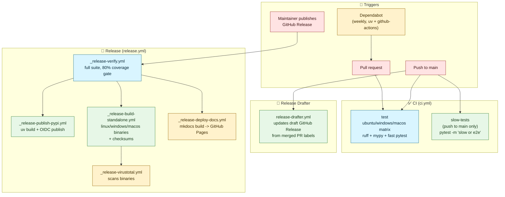

# PIIDigger - CI/CD Pipeline Architecture

## Overview

### Purpose
Document how GitHub Actions verifies pull requests, drafts release notes, and
publishes a release to PyPI, GitHub Releases, and GitHub Pages.

### Context
This pipeline sits outside the coordinator/worker runtime — it is the automation
that gates merges to `main` and turns a published GitHub Release into
distributable artifacts.

### Status
Active now. Workflows live in `.github/workflows/`.

### Scope
Covers the CI workflow (lint, type check, tests), Release Drafter, Dependabot,
and the Release workflow and its reusable sub-workflows. Does not cover the
`uv`/`ruff`/`mypy` configuration itself — see `pyproject.toml` — or the
per-component test seams in
[testing-requirements.md](../quality/testing-requirements.md).

## Architectural Principles

### Design Goals
- **Fast PR feedback**: pull requests only run the fast test suite
  (`not slow and not e2e`) across three OSes; slow/e2e tests run on `main` push only.
- **Reusable release steps**: each release action (verify, publish, build, scan,
  deploy) is its own `workflow_call`-triggered file so it can also be run manually
  via `workflow_dispatch` for debugging.
- **Fail closed before publishing**: `verify` re-runs the full test suite
  (all markers, 80% coverage gate) before any artifact is built or published.
- **Human-gated releases**: nothing publishes until a maintainer clicks
  "Publish release" on a Release Drafter draft — there is no auto-publish on tag push.
- **No long-lived secrets in workflow files**: PyPI publishing uses OIDC trusted
  publishing (`id-token: write`), not a stored API token.

### Key Benefits
- **Cross-platform confidence**: every PR is proven on Windows, Linux, and macOS
  before merge, matching the three platforms PIIDigger ships standalone binaries for.
- **Low release friction**: Release Drafter keeps a running draft of the next
  release's notes from merged PR titles/labels, so cutting a release is a review-and-publish action, not a changelog-writing session.
- **One trigger, five artifacts**: publishing a single GitHub Release fans out to
  a PyPI package, three OS-specific standalone binaries, a VirusTotal scan of
  those binaries, and a redeployed docs site.
- **Dependency drift stays visible**: Dependabot opens weekly PRs for both
  `uv`-managed Python dependencies and GitHub Actions pins, which then go through
  the same CI gate as any other PR.

## Architecture Diagram



## Workflows

### CI (`.github/workflows/ci.yml`)
Runs on every pull request, every push to `main`, and manual `workflow_dispatch`.
A concurrency group (`ci-${{ github.workflow }}-${{ github.ref }}`) cancels
superseded runs on the same ref.

- **`test`** — matrix over `ubuntu-latest`, `windows-latest`, `macos-latest`
  (`fail-fast: false`, 10-minute timeout per OS). Installs with
  `uv sync --extra dev --extra test`, then runs `ruff check src/ tests/`,
  `mypy src/`, and
  `pytest tests/ -m "not slow and not e2e" --cov=src/piidigger --cov-fail-under=80`.
  `ruff format --check` is intentionally not run — ruff 0.15.17's formatter
  corrupts `except (A, B):` into invalid Python 3 syntax in
  `src/piidigger/filehandlers/pdf.py` and `src/piidigger/run.py`. Re-enable it
  once a ruff release fixes that, verified with `ruff format --diff` first.
- **`slow-tests`** — only fires on `push` (not on pull requests), `ubuntu-latest`
  only, 30-minute timeout. Runs `pytest -m "slow or e2e"` with no coverage gate.
  This keeps PR feedback fast while still exercising timeout/reliability and
  full end-to-end scans on every `main` push.

### Release Drafter (`.github/workflows/release-drafter.yml`)
Runs on push to `main` and `workflow_dispatch`. Uses `release-drafter/release-drafter@v6`
to maintain a draft GitHub Release whose body is generated from merged PRs since
the last release. Configured by `.github/release-drafter.yml`:

- **Autolabeler** maps Conventional Commit-style PR title prefixes
  (`feat:`, `fix:`, `docs:`, `chore:`, `refactor:`) to labels, plus a `ci` label
  for PRs touching `.github/workflows/**`.
- **Categories** group the changelog into 🚀 Features, 🐛 Bug Fixes,
  📚 Documentation, and 🧰 Maintenance (chore/refactor/ci/dependencies).
- **Version resolver** bumps major for a `major` label, minor for
  `feature`/`enhancement`, and patch for everything else (fix/bug/chore/docs/refactor/ci),
  defaulting to patch.

A maintainer reviews and edits the draft, then publishes it — that publish
event is what triggers `release.yml`.

### Dependabot (`.github/dependabot.yml`)
Opens weekly PRs for two ecosystems, both rooted at `/`: `github-actions` (pins
in workflow files) and `uv` (Python dependencies in `pyproject.toml`/`uv.lock`).
These PRs go through the same `ci.yml` gate as any human-authored PR before merge.

### Release (`.github/workflows/release.yml`)
Triggers only on `release: published` — not on tag push. Concurrency is grouped
per tag name with `cancel-in-progress: false`, so two releases can't clobber
each other but a single release's jobs always run to completion. Jobs call
reusable workflows (each also independently `workflow_dispatch`-able for
debugging a single stage):

1. **`verify`** (`_release-verify.yml`) — full test suite, all markers, no
   exclusions, same 80% coverage gate as CI. Nothing downstream starts until
   this passes.
2. **`publish-pypi`** (`_release-publish-pypi.yml`, needs `verify`) — checks the
   release tag (`vX.Y.Z`) matches `piidigger.__version__`, fails the run on
   mismatch, then `uv build`s an sdist and wheel and publishes via
   `pypa/gh-action-pypi-publish` using OIDC trusted publishing
   (`id-token: write`, `environment: pypi`) — no stored PyPI token.
3. **`build-standalone`** (`_release-build-standalone.yml`, needs `verify`) —
   builds standalone binaries for three platforms in parallel and attaches
   them to the GitHub Release:
   - *linux*: built inside a `manylinux2014` Docker container (glibc 2.17) via
     `.github/scripts/build-linux-standalone.sh`, run with `docker run` rather
     than a job-level `container:` because GitHub's JS-based actions need a
     newer glibc/Node than the CentOS-7 base image provides.
   - *windows*: embedded-Python build via `build_windows_embedded.ps1`, zipped.
   - *macos*: matrix over `macos-latest` (arm64) and `macos-13` (x86_64),
     built directly with `pyinstaller --onedir`. Unsigned/unnotarized —
     Gatekeeper shows an "unidentified developer" warning, documented as a
     known limitation in `docs/user-guides/installation.md` rather than solved
     (code-signing needs a paid Apple Developer account).
   - *checksums*: after all three OS builds, downloads every artifact and
     attaches a single `checksums.txt` (`sha256sum`) to the release.
4. **`virustotal-scan`** (`_release-virustotal.yml`, needs `build-standalone`) —
   scans the `.tar.gz`/`.zip` binaries with `crazy-max/ghaction-virustotal`
   (pinned to a commit SHA) and updates the release body with scan result
   links. Rate-limited to 4 requests/minute to match the free VirusTotal API tier.
5. **`deploy-docs`** (`_release-deploy-docs.yml`, needs `verify`) — builds the
   MkDocs site (`uv sync --extra docs && uv run mkdocs build`) and deploys it
   to GitHub Pages via `actions/deploy-pages`. Uses the `pages` concurrency
   group with `cancel-in-progress: false` so a docs deploy always finishes.

## Extension Points

- **Add a CI check**: add a step to the `test` job in `ci.yml`. It runs on all
  three OSes and blocks merge — put anything OS-sensitive here instead of in a
  slow/e2e-only path.
- **Add a slow or platform-flaky test**: mark it `@pytest.mark.slow` or
  `@pytest.mark.e2e` so it runs on `main` push (`slow-tests` job) and in
  `_release-verify.yml`, but not on every PR.
- **Add a release stage**: create a new `_release-*.yml` reusable workflow
  (`on: workflow_call` + `workflow_dispatch`), then add a `needs:` entry
  pointing at it in `release.yml`. `secrets: inherit` is required if the new
  workflow needs repo secrets.
- **Change changelog categories or version bump rules**: edit
  `.github/release-drafter.yml` — the `categories`, `autolabeler`, and
  `version-resolver` sections are declarative, no workflow YAML changes needed.

## Usage Examples

```bash
# Reproduce the CI test job locally
uv sync --extra dev --extra test
uv run ruff check src/ tests/
uv run mypy src/
uv run pytest tests/ -m "not slow and not e2e" -v --cov=src/piidigger --cov-fail-under=80

# Reproduce the release verify job locally (full suite, all markers)
uv run pytest tests/ -v --cov=src/piidigger --cov-fail-under=80
```

Manually re-running a single release stage (e.g. after a transient VirusTotal
failure) without cutting a new release: open the workflow in the Actions tab
and use "Run workflow" (`workflow_dispatch`) on `_release-virustotal.yml`.

## Cross-References

- [Testing Requirements](../quality/testing-requirements.md) — coverage targets
  and test layering that `ci.yml`/`_release-verify.yml` enforce.
- [.github/workflows/ci.yml](../../../.github/workflows/ci.yml)
- [.github/workflows/release.yml](../../../.github/workflows/release.yml)
- [.github/release-drafter.yml](../../../.github/release-drafter.yml)
- [.github/dependabot.yml](../../../.github/dependabot.yml)
- [docs/user-guides/installation.md](../../user-guides/installation.md) —
  documents the unsigned-binary Gatekeeper limitation for end users.
