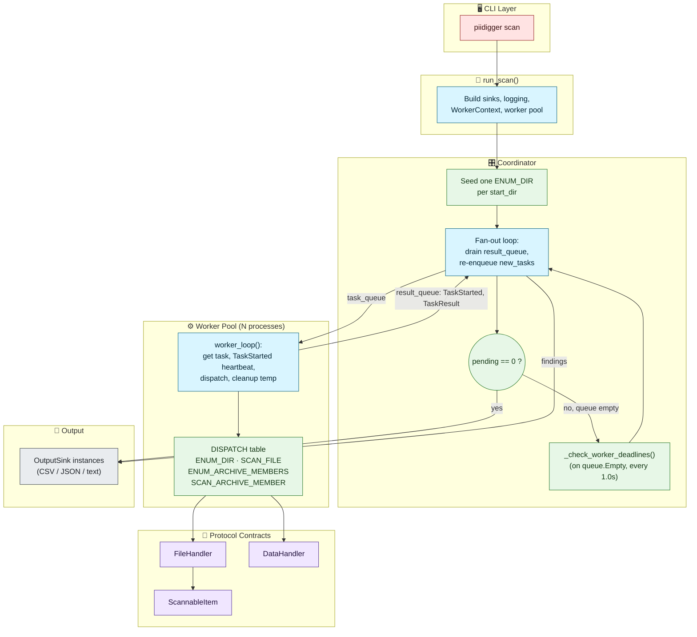

# Coordinator/Worker Task Pipeline

## Overview

### Purpose
One coordinator process feeds N worker processes through a single task queue. Workers report back on a result queue. The coordinator tracks how much work remains and stops the run once it reaches zero.

### Context
This is the core of PIIDigger's 2.0 orchestration layer, replacing the 1.x `ProcessManager`/SENTINEL-chain design. Every scan — filesystem enumeration, file scanning, archive enumeration, archive member scanning — flows through this same pipeline.

### Status
Active now. Phases 0-4 of the rewrite are complete; the task types and handlers described here are load-bearing production code.

### Scope
This document covers the coordinator/worker mechanics: task dispatch, heartbeats, deadline detection, and shutdown. It does not repeat the contributor how-to for adding a new file/data/output handler — see [Extending PIIDigger](../../reference/extending.md) for that. Archive-specific enumeration and extraction are covered in [Archive Handling](../archives/archive-handling.md).

## Architectural Principles

### Design Goals
- **Termination is a property of the work set**: the run ends when `pending == 0` — every enqueued task has produced exactly one result. No SENTINEL chains, no explicit "last task" signaling.
- **Uniform task/result shape**: every task type carries a `dict` payload and every handler returns a `TaskResult`; the coordinator never branches on task type except to look up a display path for logging.
- **Fan-out without foresight**: a handler doesn't know how many more tasks its work will produce — it just returns `new_tasks`, and the coordinator's `pending` counter absorbs however many come back.
- **Failure detection by heartbeat, not by watching each worker**: the coordinator only checks worker health when the result queue goes quiet, not on every loop iteration.

### Key Benefits
- **Adding a task type costs one `DISPATCH` entry and one handler function** — the coordinator and worker loop are unchanged. Proven twice already: `ENUM_ARCHIVE_MEMBERS` and `SCAN_ARCHIVE_MEMBER` were added in Phase 5 with zero changes to `coordinator.py` or `worker/_loop.py`.
- **A hung or crashed worker doesn't stall the run**: it's replaced and its task is either marked `timeout`/re-queued, keeping `pending` accurate.
- **Business logic is testable without a process tree**: handlers are plain functions of `(Task, WorkerContext, logging.Logger) -> TaskResult`.

## Architecture Diagram

## Core Implementation

### `run_scan()` — wiring order
[run.py](../../../src/piidigger/run.py) builds everything the coordinator needs, in this order: 

1. Open output sinks
2. Start the logging listener
3. Run the admin-privilege check
4. Build `WorkerContext` and start the worker pool
5. Start the progress display
6. Call `run_coordinator()`. 

Teardown — joining workers, flushing sinks, stopping the listener and progress display — lives entirely inside `run_coordinator()`'s `finally` block, so it runs on both normal completion and `KeyboardInterrupt`.

### `WorkerContext` — the one thing every process shares
[context.py](../../../src/piidigger/orchestration/context.py) is a frozen `dataclass`, not a Pydantic model, because it carries `mp.Queue` and `mp.synchronize.Event` — opaque OS objects Pydantic cannot validate. It holds `config`, `task_queue`, `result_queue`, `log_queue`, `stop_event`, and `temp_base` (the per-run temp root used for archive member extraction). A live `logging.Logger` or `rich.Console` is never placed on it — each process builds its own logger via `build_worker_logger(ctx.log_queue, name)`.

### `worker_loop()` — dispatch
[orchestration/worker/_loop.py](../../../src/piidigger/orchestration/worker/_loop.py) pulls one item from `task_queue` at a time. A `ShutdownSentinel` (the module-level `SHUTDOWN` singleton, matched by `isinstance` since pickling breaks identity across the spawn boundary) ends the loop. For a real `Task`, the worker posts a `TaskStarted` heartbeat, calls `_dispatch()`, and always runs `_cleanup_temp_workspace()` in a `finally` — this securely deletes (via `secure_delete()`) any files the task wrote under `temp_base/<task_id>` and removes the directory tree, whether or not the task produced an archive member.

`DISPATCH` currently has 5 entries:

| `TaskType` | Handler |
|---|---|
| `ENUM_DIR` | `handle_enum_dir` |
| `SCAN_FILE` | `handle_scan_file` |
| `ENUM_ARCHIVE_MEMBERS` | `handle_enum_archive_members` |
| `SCAN_ARCHIVE_MEMBER` | `handle_scan_archive_member` |
| `NOOP` | `_handle_noop` (test-only; supports `{"delay_seconds": N}` for deadline-detection tests) |

`_dispatch()` wraps the handler call: any uncaught exception becomes a `status="error"` `TaskResult` rather than crashing the worker process.

### `run_coordinator()` — fan-out and failure handling
[coordinator.py](../../../src/piidigger/orchestration/coordinator.py) seeds one `ENUM_DIR` task per `config.start_dirs`, then loops while `pending > 0`:

- Pull one message from `result_queue` with a 1-second timeout (`HEARTBEAT_CHECK_INTERVAL`).
- A `TaskStarted` message records `(worker_pid, dispatch_time, timeout_seconds)` in an in-flight map — it does not change `pending`.
- A `TaskResult` decrements `pending` by one, then increments it by `len(result.new_tasks)` as those are re-enqueued. Findings are routed to every `OutputSink`.
- On `queue.Empty` (nothing arrived within the timeout), `_check_worker_deadlines()` runs.

`_check_worker_deadlines()` covers two failure modes:

1. **Timeout**: a task has been in-flight longer than `2 × timeout_seconds`. The worker is terminated, a replacement is spawned immediately, and a synthetic `status="timeout"` result decrements `pending`.
2. **Crash before heartbeat**: a worker process is no longer alive but its dequeued task never got a `TaskStarted` heartbeat. After `_CRASH_DETECT_TIMEOUT` (30s) with no heartbeat, the task is re-queued as a new `Task` (same payload, new `task_id`) up to `MAX_RETRIES = 3` times; beyond that, it's dropped with a synthetic error.

On `KeyboardInterrupt`, the loop exits, cancels queue feeder threads before any blocking teardown step, and gives workers a short (2s vs. the normal 5s) join window. A second `Ctrl-C` during teardown force-terminates everything without waiting.

## Protocols

Five `Protocol` classes in [protocols.py](../../../src/piidigger/protocols.py) define every extension surface:

- **`ScannableItem`** — a scannable unit of content (`display_path`, `ext`, `mime`, `size`, `depth`, `open_stream()`, `open_bytes()`, `materialize()`). `FilesystemItem` is the only implementation — it represents both on-disk files and extracted archive members via optional `archive_path`/`member_path` kwargs.
- **`FileHandler`** — reads a `ScannableItem` into text chunks (`plaintext`, `docx`, `pdf`, `xlsx`, `xls`).
- **`DataHandler`** — finds PII matches in a text chunk (`pan`, `email`; `phonenum`/`trackdata` are stub/not yet implemented).
- **`OutputSink`** — writes a `ResultRecord` to a destination (`csv`, `json`, `text`).
- **`ArchiveHandler`** — lists and extracts archive members. Covered in depth in [Archive Handling](../archives/archive-handling.md).

For how to implement one of these to add a new handler, see [Extending PIIDigger](../../reference/extending.md) — this document only names the contracts the pipeline dispatches through.

## Extension Points

Adding a task type means: add one `TaskType` enum value, one payload model in `models/payloads.py`, one handler function of type `(Task, WorkerContext, logging.Logger) -> TaskResult`, and one `DISPATCH` entry. Nothing in `coordinator.py` or the rest of `worker/_loop.py` needs to change — this is a proven exit criterion from Phase 5 (verified by diff: zero changes to either file when the two archive task types were added).

## Performance Considerations

- **Heartbeat check interval**: 1.0 second (`HEARTBEAT_CHECK_INTERVAL`). This is how often the coordinator polls worker health when the result queue is idle — it does not add latency to normal result processing, which is driven by queue arrivals.
- **Timeout multiplier**: a task is only declared timed-out at `2 × timeout_seconds`, not at `timeout_seconds` itself — this absorbs normal scheduling jitter without doubling real wait time for the common case (results usually arrive well under the limit).
- **Crash-orphan retry cap**: `MAX_RETRIES = 3` per task before it's dropped with a synthetic error, preventing an unrecoverable task (e.g. one that reliably crashes its worker) from retrying forever.
- **Join budget**: `join_workers()` uses one shared wall-clock deadline across all workers (default 5s, 2s during a `KeyboardInterrupt`), not a per-worker timeout — so worker count doesn't multiply shutdown latency.

## Testing Notes

See [Testing Requirements](../quality/testing-requirements.md) for the project-wide testing standard. Orchestration-specific coverage (deadline timeout, crash-orphan requeue, `Ctrl-C` teardown) lives in `tests/test_coordinator.py`.

## Cross-References

- [docs/refactor/ARCHITECTURE_REDESIGN.md](../../refactor/ARCHITECTURE_REDESIGN.md) — the original design proposal for this system. Historical: written before `worker.py` became a package and before `archivehandlers/` existed; treat this document as the current source of truth where the two differ.
- [docs/refactor/IMPLEMENTATION_CHECKLIST.md](../../refactor/IMPLEMENTATION_CHECKLIST.md) — phase-by-phase build status.
- [docs/reference/extending.md](../../reference/extending.md) — contributor guide for adding handlers.
- [Archive Handling](../archives/archive-handling.md) — the `ENUM_ARCHIVE_MEMBERS`/`SCAN_ARCHIVE_MEMBER` handlers in depth.
