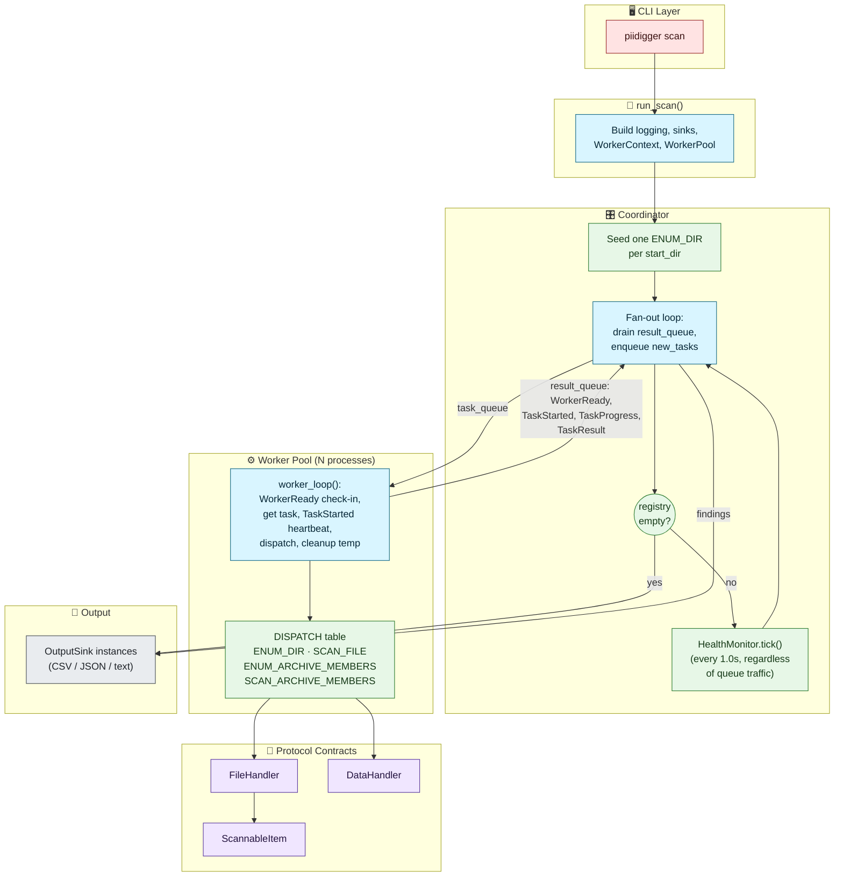

# Coordinator/Worker Task Pipeline

## Overview

### Purpose
One coordinator process feeds N worker processes through a single task queue. Workers report back on a result queue. The coordinator tracks how much work remains and stops the run once every task is accounted for.

### Context
This is the core of PIIDigger's 2.0 orchestration layer, replacing the 1.x `ProcessManager`/SENTINEL-chain design. Every scan — filesystem enumeration, file scanning, archive enumeration, archive member scanning — flows through this same pipeline.

### Status
Active now. Phases 0-5 of the rewrite are complete, followed by a reliability hardening pass covering task-loss recovery, worker crash and startup handling, and shutdown correctness. The coordinator, `TaskRegistry`, `WorkerPool`, and the task types and handlers described here are all load-bearing production code.

### Scope
This document covers the coordinator/worker mechanics: task dispatch, heartbeats, health sweeps, and shutdown. It does not repeat the contributor how-to for adding a new file/data/output handler — see [Extending PIIDigger](../../reference/extending.md) for that. Archive-specific enumeration and extraction are covered in [Archive Handling](../archives/archive-handling.md).

## Architectural Principles

### Design Goals
- **Termination is a property of the work set**: the run ends when the task registry is empty — every enqueued task has been accounted for (completed, timed out, redispatched to completion, or abandoned). No SENTINEL chains, no explicit "last task" signaling.
- **Uniform task/result shape**: every task type carries a `dict` payload and every handler returns a `TaskResult`; the coordinator never branches on task type except to look up a display path for logging.
- **Fan-out without foresight**: a handler doesn't know how many more tasks its work will produce — it just returns `new_tasks`, and the registry absorbs however many come back.
- **Failure detection on a fixed cadence, not by watching each worker**: the coordinator runs one health sweep every `HEARTBEAT_CHECK_INTERVAL` regardless of how busy the result queue is, not only when it goes quiet. A sweep gated on queue idleness missed hung or crashed workers for as long as the scan stayed busy.
- **A deadline detects silence, not length**: a long task reports progress as it goes, and each report pushes its deadline back. Progress is event-driven — sent only when work actually happens — so a stuck worker goes quiet and still times out.

### Key Benefits
- **Adding a task type costs one `DISPATCH` entry and one handler function** — the coordinator and worker loop are unchanged. A task that covers many items gets per-item progress and recovery from the generic `Task.items` and `TaskProgress` mechanics, without the coordinator reading its payload.
- **A hung or crashed worker doesn't stall the run**: three independent checks — deadline, crash, and lost-task — replace and redispatch around it, keeping the registry an accurate picture of outstanding work.
- **A task is never silently lost**: even a task whose worker died before it could send a single heartbeat is found and redispatched, under the same `task_id`, so a late duplicate result is dropped rather than double-counted.
- **Business logic is testable without a process tree**: handlers are plain functions of `(Task, WorkerContext, logging.Logger) -> TaskResult`. The coordinator's own bookkeeping — `TaskRegistry`, `WorkerPool`, `HealthMonitor` — is equally testable with injected fakes; none of it requires spawning a process.

## Architecture Diagram

```mermaid
flowchart TB
    subgraph cli_group["🖥️ CLI Layer"]
        CLI["piidigger scan"]:::cli
    end

    subgraph run_group["🔧 run_scan()"]
        RUN["Build logging, sinks,\nWorkerContext, WorkerPool"]:::coreService
    end

    subgraph coord_group["🎛️ Coordinator"]
        SEED["Seed one ENUM_DIR\nper start_dir"]:::component
        LOOP["Fan-out loop:\ndrain result_queue,\nenqueue new_tasks"]:::coreService
        SWEEP["HealthMonitor.tick()\n(every 1.0s, regardless\nof queue traffic)"]:::component
        REGISTRY(("registry\nempty?")):::component
    end

    subgraph worker_group["⚙️ Worker Pool (N processes)"]
        WLOOP["worker_loop():\nWorkerReady check-in,\nget task, TaskStarted heartbeat,\ndispatch, cleanup temp"]:::coreService
        DISPATCH["DISPATCH table\nENUM_DIR · SCAN_FILE\nENUM_ARCHIVE_MEMBERS\nSCAN_ARCHIVE_MEMBERS"]:::component
    end

    subgraph protocol_group["📐 Protocol Contracts"]
        FH["FileHandler"]:::protocol
        DH["DataHandler"]:::protocol
        SI["ScannableItem"]:::protocol
    end

    subgraph sink_group["💾 Output"]
        SINKS["OutputSink instances\n(CSV / JSON / text)"]:::storage
    end

    CLI --> RUN --> SEED --> LOOP
    LOOP -->|task_queue| WLOOP --> DISPATCH
    DISPATCH --> FH --> SI
    DISPATCH --> DH
    WLOOP -->|result_queue: WorkerReady,\nTaskStarted, TaskProgress,\nTaskResult| LOOP
    LOOP --> REGISTRY
    REGISTRY -->|no| SWEEP --> LOOP
    REGISTRY -->|yes| SINKS
    LOOP -->|findings| SINKS

    classDef coreService fill:#d9f5ff,stroke:#176b87,stroke-width:1px,color:#062635
    classDef protocol fill:#f0e6ff,stroke:#5b3a9e,stroke-width:1px,color:#24143f
    classDef component fill:#e7f7e7,stroke:#2f7d32,stroke-width:1px,color:#163917
    classDef cli fill:#ffe3e3,stroke:#9b2c2c,stroke-width:1px,color:#3b1212
    classDef storage fill:#e9ecef,stroke:#495057,stroke-width:1px,color:#1f2328
```

## Core Implementation

### `run_scan()` — wiring order
[run.py](../../../src/piidigger/run.py) builds everything the coordinator needs, in this order:

1. Start the logging listener, and route third-party library logs (WARNING and above) to it
2. Run the admin-privilege check
3. Open output sinks. A failure aborts the run with `EXIT_ABORTED`, reported on stderr and in the log, because there would be nowhere to put the results.
4. Build `WorkerContext`, build a `WorkerPool` bound to `spawn_worker(ctx)`, and start it
5. Start the progress display
6. Call `run_coordinator()`, then remove the per-run temp workspace (`secure_rmtree`) and stop the logging listener as a backstop, whether or not the coordinator raised

Teardown under normal operation — stopping the workers, flushing sinks, stopping the listener and the progress display — lives entirely inside `run_coordinator()`'s `finally` block, so it runs on both normal completion and `KeyboardInterrupt`. `run.py`'s own `finally` exists only to catch exceptions that escape the coordinator before that block runs; without it, a raised exception would leave the temp workspace — extracted archive members, i.e. plaintext PII — on disk.

### `WorkerContext` — the one thing every process shares
[context.py](../../../src/piidigger/orchestration/context.py) is a frozen `dataclass`, not a Pydantic model, because it carries `mp.Queue` and `mp.synchronize.Event` — opaque OS objects Pydantic cannot validate. It holds `config`, `task_queue`, `result_queue`, `log_queue`, `stop_event`, `temp_base` (the per-run temp root used for archive member extraction), and `n_workers` (the pool size, which archive enumeration uses to split an archive into batches). A live `logging.Logger` or `rich.Console` is never placed on it — each process builds its own logger via `build_worker_logger(ctx.log_queue, name)`.

`stop_event` is set by the coordinator's teardown, before it broadcasts shutdown sentinels. A worker that takes any item — sentinel or leftover task — after `stop_event` is set exits without running it. This is what lets a duplicate task, still sitting in the queue behind the sentinels, be dropped instead of running to completion and eating the shutdown budget.

### `worker_loop()` — dispatch
[orchestration/worker/_loop.py](../../../src/piidigger/orchestration/worker/_loop.py) starts by posting `WorkerReady(worker_pid)` on `result_queue` — a one-time check-in. After that message, a worker that is not running a task can only be blocked in `task_queue.get()`; the coordinator's lost-task sweep depends on that guarantee. The worker then pulls one item from `task_queue` at a time. A `ShutdownSentinel` (the module-level `SHUTDOWN` singleton, matched by `isinstance` since pickling breaks identity across the spawn boundary) ends the loop, as does any item taken once `ctx.stop_event` is set. For a real `Task`, the worker posts a `TaskStarted` heartbeat, calls `_dispatch()`, and always runs `_cleanup_temp_workspace()` in a `finally` — this securely deletes (via `secure_delete()`) any files the task wrote under `temp_base/<task_id>` and removes the directory tree, whether or not the task produced an archive member.

`DISPATCH` currently has 5 entries:

| `TaskType` | Handler |
|---|---|
| `ENUM_DIR` | `handle_enum_dir` |
| `SCAN_FILE` | `handle_scan_file` |
| `ENUM_ARCHIVE_MEMBERS` | `handle_enum_archive_members` |
| `SCAN_ARCHIVE_MEMBERS` | `handle_scan_archive_members` (one batch: a contiguous run of members from one archive) |
| `NOOP` | `_handle_noop` (test-only; supports `{"delay_seconds": N}` for deadline-detection tests) |

`_dispatch()` wraps the handler call: any uncaught exception becomes a `status="error"` `TaskResult` rather than crashing the worker process. A worker that dies outright — a segfault in a native parser, for example — is a separate failure mode, handled by the coordinator's crash sweep below, not by `_dispatch()`.

### `TaskRegistry` — the outstanding-work record
[orchestration/registry.py](../../../src/piidigger/orchestration/registry.py) replaces the old `pending` integer and the several dicts that used to track it in lockstep. A task is *registered* (`enqueue()`) when it reaches the task queue and *retired* (`retire()`) when its outcome is accounted for; `len(registry)` — the loop's termination check — is the count of tasks neither state has removed. 

Each `TaskRecord` tracks:

* Whether a heartbeat has arrived (`started_at`)
* How many redispatch attempts it has had (`attempt`, capped by `MAX_RETRIES = 3`)
* When the holding worker last reported progress (`last_progress_at`)
* The Task's deadline
    * `2 × timeout_seconds` after `started_at` or `last_progress_at`, whichever is later;
    * `None` while unstarted, since an unclaimed task cannot be judged hung.

A task abandoned by the deadline or crash sweep is retired but kept in a small side table (`abandon()`/`reclaim()`), so that if its original attempt's result turns up after all, `reclaim()` recognizes it and its findings are still routed to sinks rather than silently dropped — it is the only report of that work.

#### Tasks with items
A task can carry a work list in `Task.items`. Today only `SCAN_ARCHIVE_MEMBERS` does: its items are the member paths of one batch, in archive order. The registry never reads payloads; `items` is the only part of a task it changes.

For such a task, the record also holds:

* `remaining` — the items not yet reported done. It is the single record of outstanding work. A dict serves as an ordered set, because removing from the front of a list would itself be quadratic over a 10,000-member batch.
* `current_item` — the item the holding worker said it was starting and has not finished. That is the item to blame if the worker hangs or dies.

`requeue_remaining()` drops `current_item` and puts the task back with `items` trimmed to `remaining`. The health sweeps call it after a timeout or crash. The coordinator also calls it when the holding worker returns an error result while an item is in progress, so one unreadable member fails alone instead of failing the batch. A requeued batch therefore starts where the last attempt stopped, with no separate skip list. `redispatch()` trims `items` the same way. A dropped item is remembered for the end-of-scan summary. If its late `item_done` turns up after all, the registry accepts it once and forgets the skip.

Summary counts are in files and members, not tasks. An abandoned batch counts its remaining members, and each dropped member counts once.

### `WorkerPool` — process lifecycle
[orchestration/pool.py](../../../src/piidigger/orchestration/pool.py) is the single place worker processes are created (`spawn_worker`, `daemon=True` so a straggler cannot block interpreter exit), replaced, and stopped. `replace(pid)` removes a pid from the active set *before* starting its replacement, so a pid can be replaced at most once even if both the deadline sweep and the crash sweep notice the same death. `reap_dead()` replaces any worker that died without being asked to. Stopping a worker escalates `terminate()` then `kill()`; a process that survives both is kept as a straggler rather than dropped, so teardown still accounts for it.

The pool also tracks, per worker, whether it has checked in (`WorkerReady` or `TaskStarted` received). If `_MAX_STARTUP_FAILURES` (3) consecutive workers before checking in — a broken install, a quarantined DLL — the pool stops replacing them (`replacing` becomes `False`) rather than respawning forever.

### `run_coordinator()` — fan-out and failure handling
[coordinator.py](../../../src/piidigger/orchestration/coordinator.py) seeds one `ENUM_DIR` task per `config.start_dirs` into a fresh `TaskRegistry`, then drains `result_queue` until the registry is empty:

- Pull one message with a timeout bounded by the next scheduled sweep (at most `HEARTBEAT_CHECK_INTERVAL`, 1 second).
- A `WorkerReady` message only checks the worker in with the pool.
- A `TaskStarted` message marks the task RUNNING (`registry.record_start`) and checks the worker in.
- A `TaskProgress` message pushes the task's deadline back (only when it comes from the worker holding the task). An `item_done` also routes that item's findings to sinks and its counters to the progress display — unless the registry has already seen that item, in which case both are dropped as a duplicate.
- A `TaskResult` retires the task. An id no longer in the registry is usually a duplicate — another copy of a redispatched task already finished — and is dropped, *unless* it was retired by abandonment (`reclaim()` succeeds), in which case its findings are still routed to sinks. `new_tasks` from the result are validated and enqueued; a malformed one (`Task`'s `extra="forbid"` rejecting it) is logged and dropped rather than aborting the whole run.
- Whether or not a message arrived, once `HEARTBEAT_CHECK_INTERVAL` has elapsed since the last sweep, `HealthMonitor.tick()` runs — on the same cadence whether the result queue is idle or saturated.

`HealthMonitor.tick()` runs three checks, in order:

1. **Deadline sweep**: a RUNNING task past its deadline (`2 × timeout_seconds` of silence) is abandoned and its worker replaced. Timeouts are not retried — a task that hung once will most likely hang again. For a task with items and a `current_item`, only that item is dropped; the rest of the task is requeued.
2. **Crash sweep**: `pool.reap_dead()` replaces any worker that died unprompted. Every RUNNING task whose worker pid is no longer in the pool — whether it died this tick or was already reaped when its heartbeat arrived late — is redispatched under the *same* `task_id`, or abandoned once `MAX_RETRIES` is spent. A task with items and a `current_item` drops that item and requeues the rest instead. That uses no retry budget, because each such requeue removes an item. Because the deadline sweep runs first, a worker already replaced for a timeout cannot be replaced again here.
3. **Lost-task sweep**: catches a task whose worker died *before* sending its `TaskStarted` heartbeat, which is invisible to the first two checks since no worker is recorded as holding it. If nothing is RUNNING, every live worker has checked in, and that holds for `LOST_TASK_CONFIRM_SWEEPS` (2) consecutive sweeps with no message arriving in between — and every outstanding task is at least `LOST_TASK_MIN_AGE` (2s) old — then whatever is still in the registry cannot be held by any process: it is redispatched or abandoned. No queue introspection is involved (`qsize()` is unimplemented on macOS; `empty()` is only approximate). Reusing the `task_id` on redispatch means a false-positive firing is harmless: whichever copy of the task finishes first retires it, and the other is dropped as a duplicate.

### `TaskProgress` — keeping a long task alive
A batch of archive members can run far longer than `timeout_seconds`. It sends `TaskProgress` messages on `result_queue` between its `TaskStarted` and its `TaskResult`:

| Event | When | Carries |
|---|---|---|
| `item_started` | Just before an item is extracted | The item |
| `item_done` | After the item is scanned and securely deleted | The item, its findings, its counters |
| `alive` | While compressed bytes are read, at most once a second | Nothing |

Findings reach the sinks as each item finishes, so a later hang or crash cannot lose them. `TaskProgress` is a Pydantic model, unlike `TaskStarted`, because its findings come from file content.

Progress is **event-driven, never clock-driven**. `ProgressReporter` ([worker/_reporter.py](../../../src/piidigger/orchestration/worker/_reporter.py)) sends a message only when the handler reports that something happened. There is no timer thread. A timer would keep sending while the worker's main thread was stuck, and hide exactly the hang the deadline exists to catch. `alive` comes from a wrapper on the archive file's `read()`. So it fires only while bytes actually move, and the one-second cap only limits queue traffic. A worker stuck in a parser or a C decoder sends nothing, and its deadline fires after `2 × timeout_seconds`, as for any other task.

How `TaskProgress` meets each sweep:

| Sweep | Effect |
|---|---|
| Deadline | Slides the deadline forward, but only for messages from the pid holding the task. A stale copy cannot keep a task alive. |
| Crash | None. A dead worker sends nothing, and a late message from a replaced pid fails the pid match. |
| Lost task | None. That sweep acts only when nothing is RUNNING, and progress comes only from a RUNNING task. Like any message, it restarts the quiet count. |
| Pool check-in | None. Only `WorkerReady` and `TaskStarted` check a worker in. |

If the pool stops replacing workers (see `WorkerPool` above) and ends up with none left, the lost-task sweep's "every live worker has checked in" is vacuously true, so it redispatches and then abandons every outstanding task — the run ends instead of hanging.

On `KeyboardInterrupt`, `_drain()` exits and teardown (below) runs with a shorter join budget; a second `Ctrl-C` during teardown force-terminates everything without waiting.

### Teardown — one path, two budgets
`_teardown()` is the same sequence for normal completion and for `KeyboardInterrupt`; only the join budget differs (5s normally, 2s if interrupted). It sets `ctx.stop_event`, then broadcasts one shutdown sentinel per process the pool knows about (including stragglers), then calls `pool.join()`. Workers are asked to stop, not killed outright: killing a worker can cut a queue message in half, and a half-written message can hang whoever tries to read it next. `pool.join()` still escalates to `terminate()` then `kill()` for anything that does not exit within the budget. After the join, `ctx.task_queue.cancel_join_thread()` is called unconditionally — with every worker gone, nothing will ever read it again, and any task still buffered there (a redispatched copy, or every task if no worker survived) would otherwise block interpreter exit on an undrained pipe.

Stopping the log listener is itself bounded: `stop_listener(listener, timeout=5.0)` gives up rather than hanging forever if the listener thread is stuck (for example, reading a log record a killed worker wrote only half of). If it gives up, a warning goes to stderr after the progress display has stopped — too late for the log file itself, since that is what failed to stop.

### Outcome and exit codes
`run_coordinator()` returns a `CoordinatorResult` (`interrupted`, `unfinished`, `workers_failed`, `sinks_failed`) that `run_scan()` maps to a process exit code: 

* `EXIT_INTERRUPTED` (EXITCODE 130) if the user pressed Ctrl-C, 
* `EXIT_INCOMPLETE` (EXITCODE 2) if any task was left outstanding, the pool ran out of workers, or a results file stopped receiving findings
* `EXIT_ABORTED` (EXITCODE 1) if the scan failed to start; e.g. Admin check was declined, or a results file could not be opened
* `EXIT_OK` (EXITCODE 0). 

### Output sink failures
Sinks never log; they raise `OSError`. `run_scan()` treats a failed `open()` as fatal. During the scan, `run_coordinator()` wraps each sink in a `GuardedSink` ([sinks.py](../../../src/piidigger/orchestration/sinks.py)). On a sink's first write or close failure, the guard does the following:

1. Logs the error once, through the coordinator logger.
2. Shows it in the progress display's events panel.
3. Stops writing to that sink. A full disk would otherwise log once per finding.
4. Adds a "Results incomplete" line to the end-of-run summary and records the sink in `sinks_failed`.

The other sinks keep receiving findings, and the scan carries on. `close()` is still called on a failed sink to release its file handle.

A per-file failure (an access-denied error, a single timeout) does not by itself change the exit code — only a run that could not really scan anything, or one interrupted mid-scan, does. The progress display's end-of-run summary reports per-file failures, timeouts, and abandonments in a "Not fully scanned" line whenever any occurred, and its heading reads `Scan interrupted.` or `Scan stopped early` instead of `Scan complete.` when appropriate — so a truncated run is never described the same way as a full one.

## Protocols

Five `Protocol` classes in [protocols.py](../../../src/piidigger/protocols.py) define every extension surface:

- **`ScannableItem`** — a scannable unit of content (`display_path`, `ext`, `mime`, `size`, `depth`, `open_stream()`, `open_bytes()`, `materialize()`). `FilesystemItem` is the only implementation — it represents both on-disk files and extracted archive members via optional `archive_path`/`member_path` kwargs.
- **`FileHandler`** — reads a `ScannableItem` into text chunks (`plaintext`, `docx`, `pdf`, `xlsx`, `xls`).
- **`DataHandler`** — finds PII matches in a text chunk (`pan`, `email`; `phonenum`/`trackdata` are stub/not yet implemented).
- **`OutputSink`** — writes a `ResultRecord` to a destination (`csv`, `json`, `text`). Raises `OSError` instead of logging; `path` names its file in error messages. See [Output sink failures](#output-sink-failures).
- **`ArchiveHandler`** — lists and extracts archive members. Covered in depth in [Archive Handling](../archives/archive-handling.md).

For how to implement one of these to add a new handler, see [Extending PIIDigger](../../reference/extending.md) — this document only names the contracts the pipeline dispatches through.

## Extension Points

Adding a task type means: add one `TaskType` enum value, one payload model in `models/payloads.py`, one handler function of type `(Task, WorkerContext, logging.Logger) -> TaskResult`, and one `DISPATCH` entry. Nothing in `coordinator.py` or the rest of `worker/_loop.py` needs to change.

A task type that works through many items can opt into per-item progress without coordinator changes. It puts its items in `Task.items`, builds a `ProgressReporter` from `ctx.result_queue.put` and its `task_id`, and reports `item_started`/`item_done` as it goes. The registry handles the trimming and requeueing.

## Performance Considerations

- **Health sweep interval**: 1.0 second (`HEARTBEAT_CHECK_INTERVAL`). This sweep runs on a fixed cadence regardless of result-queue traffic — a busy scan is checked exactly as often as an idle one.
- **Timeout multiplier**: a task is only declared timed-out at `2 × timeout_seconds`, not at `timeout_seconds` itself (`registry._DEADLINE_FACTOR`) — this absorbs normal scheduling jitter without doubling real wait time for the common case (results usually arrive well under the limit). The clock restarts on each `TaskProgress` from the holding worker.
- **Progress traffic**: `alive` is capped at one message per second per task (`_ALIVE_INTERVAL` in `worker/_reporter.py`). `item_started` and `item_done` are not capped: two small messages per archive member.
- **Redispatch retry cap**: `MAX_RETRIES = 3` (`registry.py`) per task before it is abandoned with a synthetic error — applies uniformly to a crash-after-heartbeat redispatch and a lost-task-before-heartbeat redispatch, preventing an unrecoverable task (e.g. one that reliably crashes its worker) from retrying forever.
- **Lost-task confirmation window**: `LOST_TASK_CONFIRM_SWEEPS = 2` sweeps and `LOST_TASK_MIN_AGE = 2.0` seconds (`coordinator.py`) — both must hold before a task is judged lost, so a task that simply has not been picked up yet, or a worker still booting, is not mistaken for lost work.
- **Startup-failure breaker**: `_MAX_STARTUP_FAILURES = 3` (`pool.py`) consecutive workers dying before checking in stops the pool from replacing them — bounding how long a broken worker environment is retried before the run gives up instead of respawning forever.
- **Join budget**: `WorkerPool.join()` uses one shared wall-clock deadline across all workers (default 5s, 2s during a `KeyboardInterrupt`), not a per-worker timeout — so worker count does not multiply shutdown latency.
- **Listener stop budget**: `stop_listener()` waits at most 5 seconds (`_LISTENER_STOP_TIMEOUT`) for the log queue's background thread to drain, rather than blocking teardown forever on a stuck listener.

## Testing Notes

See [Testing Requirements](../quality/testing-requirements.md) for the project-wide testing standard. `TaskRegistry`, `WorkerPool`, and `HealthMonitor` are each unit-tested in isolation with fakes (`tests/test_task_registry.py`, `tests/test_worker_pool.py`, `tests/test_health_monitor.py`) — none of it requires spawning a process. `ProgressReporter` and the coordinator's `TaskProgress` handling are tested the same way in `tests/test_task_progress.py`. Orchestration-level coverage that does drive the real `run_coordinator()` (deadline timeout, a slow archive member skipped mid-batch, crash-after-heartbeat and lost-task-before-heartbeat redispatch, the startup-failure breaker, `Ctrl-C` teardown) lives in `tests/test_coordinator.py` and `tests/test_worker.py`.

## Cross-References

- [docs/refactor/ARCHITECTURE_REDESIGN.md](../../refactor/ARCHITECTURE_REDESIGN.md) — the original design proposal for this system. Historical: written before `worker.py` became a package, before `archivehandlers/` existed, and before the reliability hardening pass described above; treat this document as the current source of truth where the two differ.
- [docs/refactor/IMPLEMENTATION_CHECKLIST.md](../../refactor/IMPLEMENTATION_CHECKLIST.md) — phase-by-phase build status.
- [docs/reference/extending.md](../../reference/extending.md) — contributor guide for adding handlers.
- [Archive Handling](../archives/archive-handling.md) — the `ENUM_ARCHIVE_MEMBERS`/`SCAN_ARCHIVE_MEMBERS` handlers in depth, including how archives are split into batches.
