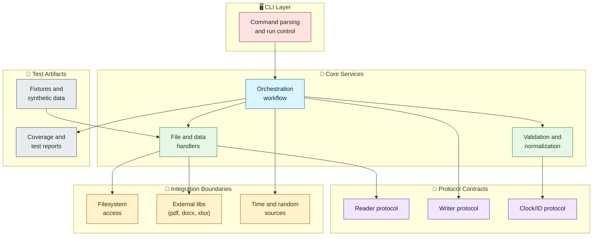

# Testing Requirements

## Overview

### Purpose
This document defines testability requirements for all PIIDigger components.

### Context
These requirements apply beyond refactoring milestones. They guide day-to-day development and release readiness.

### Status
This standard is active now.

### Scope
This document covers code design, test layers, tooling, data, and release gates.
This document does not replace feature-specific test plans.

## Architectural Principles

### Design Goals
- **Deterministic Behavior**: Tests produce stable results across local and CI runs.
- **Fast Feedback**: Most tests complete quickly and support frequent execution.
- **Explicit Boundaries**: Components expose seams for dependency replacement.
- **Observable Outcomes**: Code surfaces useful outputs, logs, and typed errors.
- **Layered Confidence**: Unit, integration, and system tests validate different risks.

### Key Benefits
- **Lower Regression Risk**: Changes hit automated checks before merge.
- **Safer Refactoring**: Behavior locks in through stable assertions.
- **Faster Debugging**: Failures point to specific layers and components.
- **Predictable Releases**: Exit criteria remain visible and measurable.
- **Team Alignment**: Contributors use shared quality targets.

## Architecture Overview Diagram



## Protocols

Use protocol contracts for test seams at all external boundaries.

```python
from __future__ import annotations

from collections.abc import Iterable
from pathlib import Path
from typing import Protocol


class FileReaderProtocol(Protocol):
    """Read source files and yield content chunks."""

    def read_chunks(self, file_path: Path, max_chunk_count: int) -> Iterable[str]:
        """Return normalized text chunks for scanning."""


class ClockProtocol(Protocol):
    """Provide time access for deterministic tests."""

    def now_iso(self) -> str:
        """Return the current timestamp in ISO-8601 format."""


class OutputWriterProtocol(Protocol):
    """Publish findings to configured output sinks."""

    def write_record(self, payload: dict[str, str]) -> None:
        """Write one normalized output record."""
```

## Configuration Models

Configuration for testing belongs in typed models with explicit defaults.

```python
from __future__ import annotations

from pathlib import Path

from pydantic import BaseModel, Field, field_validator


class TestPolicyConfig(BaseModel):
    """Global test policy used by local runs and CI."""

    max_unit_runtime_seconds: int = Field(default=30, ge=5, le=120)
    min_line_coverage_percent: int = Field(default=90, ge=70, le=100)
    fixture_root: Path = Field(default=Path("testdata"))

    @field_validator("fixture_root")
    @classmethod
    def fixture_root_must_exist(cls, value: Path) -> Path:
        """Validate that fixture root exists in repository."""
        if not value.exists():
            raise ValueError(f"Fixture directory does not exist: {value}")
        return value
```

### YAML Example

```yaml
testing:
  max_unit_runtime_seconds: 30
  min_line_coverage_percent: 90
  fixture_root: testdata
```

## Service Implementation

Production code exposes injectable dependencies and typed result models.

```python
from __future__ import annotations

from dataclasses import dataclass
from pathlib import Path


@dataclass(frozen=True)
class ScanSummary:
    """Aggregate scan result for assertions and reporting."""

    files_scanned: int
    findings_count: int


class ScannerService:
    """Scan files using injected reader and writer contracts."""

    def __init__(
        self,
        reader: FileReaderProtocol,
        writer: OutputWriterProtocol,
        clock: ClockProtocol,
    ) -> None:
        self._reader = reader
        self._writer = writer
        self._clock = clock

    def scan_file(self, file_path: Path, max_chunk_count: int) -> ScanSummary:
        """Scan one file and return a typed summary."""
        findings = 0
        for chunk in self._reader.read_chunks(file_path, max_chunk_count):
            if "@" in chunk:
                self._writer.write_record({"kind": "email", "source": str(file_path)})
                findings += 1
        _ = self._clock.now_iso()
        return ScanSummary(files_scanned=1, findings_count=findings)
```

## Container Integration

Dependency composition should stay centralized and replaceable in tests.

```python
from __future__ import annotations

from dataclasses import dataclass


@dataclass
class ServiceContainer:
    """Lightweight container for production and test composition."""

    scanner_service: ScannerService


def build_container(
    reader: FileReaderProtocol,
    writer: OutputWriterProtocol,
    clock: ClockProtocol,
) -> ServiceContainer:
    """Build service graph with explicit constructor wiring."""
    scanner_service = ScannerService(reader=reader, writer=writer, clock=clock)
    return ServiceContainer(scanner_service=scanner_service)
```

## CLI Integration

CLI commands call services and return explicit exit codes.

```python
from __future__ import annotations

import click
from pathlib import Path


@click.command("scan")
@click.argument("target", type=click.Path(path_type=Path, exists=True))
@click.option("--max-chunk-count", default=1, show_default=True, type=int)
def scan_command(target: Path, max_chunk_count: int) -> None:
    """Scan one file and print a concise summary."""
    try:
        container = build_container(reader=reader_impl, writer=writer_impl, clock=clock_impl)
        summary = container.scanner_service.scan_file(target, max_chunk_count)
        click.echo(f"scanned={summary.files_scanned} findings={summary.findings_count}")
    except OSError as exc:
        raise click.ClickException(f"I/O failure: {exc}") from exc
```

## Service Integration Patterns

- Replace filesystem access with in-memory fakes for most tests.
- Keep one integration suite for each file type handler.
- Treat parser libraries as boundaries and test adapter behavior.
- Assert structured outputs, not console string fragments.

## Usage Examples

### CLI Example

```bash
uv run pytest -q
uv run pytest tests/test_read_plaintext_file.py -q
```

### Programmatic Example

```python
summary = container.scanner_service.scan_file(Path("testdata/pii/contact-info.txt"), 1)
assert summary.files_scanned == 1
assert summary.findings_count >= 1
```

## Performance Considerations

### Test Runtime Budget
- Unit tests should complete within five minutes on CI workers.
- Integration tests should complete within ten minutes on CI workers.
- Slow tests require explicit markers and separate reporting.

### Fixture Efficiency
- Prefer minimal fixtures with stable byte sizes.
- Reuse canonical fixtures across related tests.
- Add large files only for explicit stress scenarios.

### Parallel Execution Stability
- Tests must isolate temporary directories and output files.
- Shared mutable globals are not allowed in new modules.
- Time-dependent code should use injectable clock sources.

## Testing Patterns

### Unit Test Requirements
- New logic must include unit tests for success and failure paths.
- Each public function needs at least one behavior-focused test.
- Property-based testing is recommended for parser edge cases.

### Integration Test Requirements
- Each file handler requires at least one happy-path integration test.
- Each file handler requires at least one malformed-input test.
- Worker orchestration requires queue and shutdown path coverage.

### Fixtures and Factories
- Fixtures belong in files close to their test modules.
- Factory helpers should create valid defaults with easy overrides.
- Fixture names should describe behavior, not internal details.

### Coverage Expectations
- Repository line coverage target: 90% minimum.
- Critical paths target: 95% minimum for scanner orchestration and handlers.
- PRs should not reduce coverage on modified files.

## Implementation Roadmap

### Phase 1: Baseline Policy
- [ ] Add this document to contributor onboarding references.
- [ ] Publish current baseline metrics for runtime and coverage.
- [ ] Define CI gates for minimum coverage and test duration.

### Phase 2: Testability by Design
- [ ] Add protocol seams at filesystem, time, and output boundaries.
- [ ] Convert implicit globals to injected dependencies.
- [ ] Introduce typed result models for core workflows.

### Phase 3: Layer Expansion
- [ ] Fill unit test gaps in handlers and data validators.
- [ ] Add integration tests for malformed and edge-case fixtures.
- [ ] Add orchestration tests for worker failure and recovery.

### Phase 4: Release Hardening
- [ ] Add trend reporting for duration and flaky test rates.
- [ ] Add coverage diff checks for changed files.
- [ ] Review and revise this document each quarter.

## Cross-References

- Refactor-specific testing plan: [docs/refactor/TESTING_STRATEGY.md](../../refactor/TESTING_STRATEGY.md)
- Main documentation index: [docs/README.md](https://github.com/kirkpatrickprice/PIIDigger/blob/main/README.md)
- Architecture standards: [.github/instructions/architecture.instructions.md](https://github.com/kirkpatrickprice/PIIDigger/blob/main/.github/instructions/architecture.instructions.md)
