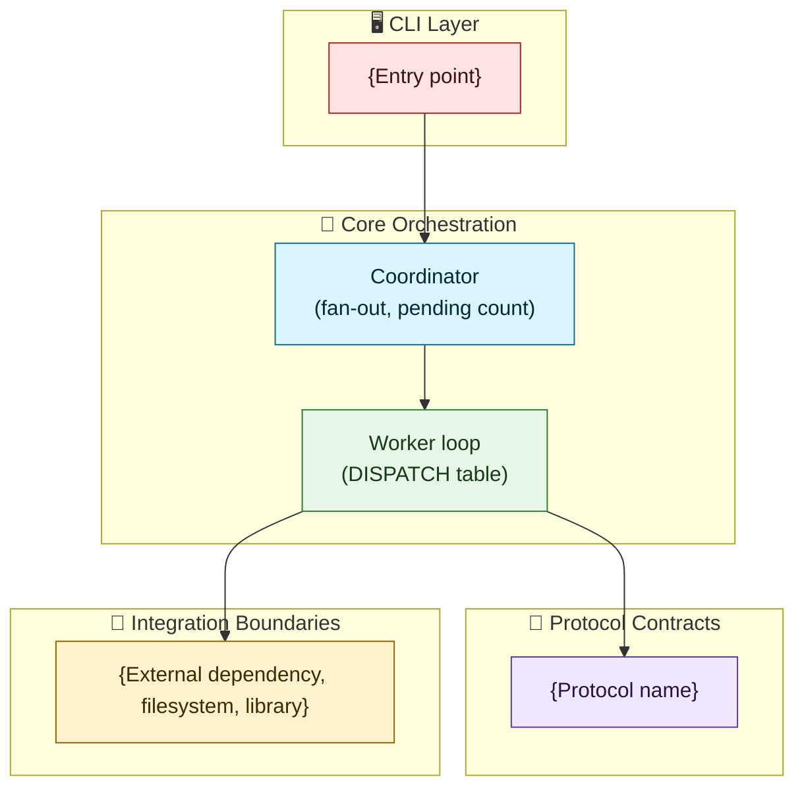

# PIIDigger - {Component Name} Architecture

## Overview

### Purpose
{One or two sentences: what this component does and why it exists.}

### Context
{Where this fits in the coordinator/worker pipeline — e.g. "runs inside each worker process," "owned by the coordinator," "a protocol implemented by every file handler."}

### Status
{Active now / part of the 2.0 refactor / planned.}

### Scope
{What this document covers. What it explicitly does not cover — link to the doc that does.}

## Architectural Principles

### Design Goals
- **{Goal 1}**: {Description of the primary design goal}
- **{Goal 2}**: {Description of another key design goal}
- **{Goal 3}**: {Description of additional design goal, 3-5 total}

### Key Benefits
- **{Benefit 1}**: {Description of primary benefit}
- **{Benefit 2}**: {Description of another benefit, 3-5 total}

## Architecture Diagram

{Mermaid diagram showing this component's real place in the coordinator -> task queue -> worker -> TaskResult flow. Only include the nodes relevant to this component.}



## Core Implementation

{The class(es) or function(s) that do the work. Plain constructor wiring — this project has no DI container. Show real signatures, not placeholders, once the code exists.}

```python
from __future__ import annotations

from dataclasses import dataclass


class {ComponentName}:
    """{One line: what this does.}"""

    def __init__(self, {dependency}: {DependencyType}) -> None:
        self._{dependency} = {dependency}

    def {public_method}(self, {parameters}) -> {return_type}:
        """{One line: what this method does.}"""
```

## Protocols

<!-- Delete this section if the component doesn't define or implement a Protocol. -->

{The contract this component implements (e.g. `DataHandler`, `FileHandler`, `OutputSink`) or defines for others.}

```python
from typing import Protocol


class {ProtocolName}(Protocol):
    """{Purpose of this contract.}"""

    def {method_name}(self, {parameters}) -> {return_type}:
        """{What implementers must do.}"""
```

## Configuration Models

<!-- Delete this section if the component has no config surface. -->

```python
from pydantic import BaseModel, Field


class {ConfigName}(BaseModel):
    """{Purpose.}"""

    {field_name}: {type} = Field(default={default_value})
```

```yaml
{section_name}:
  {field_name}: {value}
```

## Extension Points

<!-- Delete this section if the component isn't extensible (no DISPATCH entry, no new-handler pattern). -->

{How a contributor adds a new task type, handler, or sink. Point at the actual registration mechanism — a `DISPATCH` dict entry, a new module implementing a protocol — not a framework this project doesn't use.}

- {Step 1: implement the protocol}
- {Step 2: register it — e.g. add one `DISPATCH` entry}
- {Anything the coordinator/worker do NOT need to change for this to work}

## Usage Examples

```bash
uv run piidigger {command} {subcommand} --{option} {value}
```

```python
{one short, realistic programmatic example — not a Click/DI wiring block}
```

## Performance Considerations

<!-- Delete this section unless this component has a real perf story: multiprocessing, streaming, large files, backpressure. -->

- **{Consideration 1}**: {Description}
- **{Consideration 2}**: {Description}

## Testing Notes

<!-- Delete this section if `docs/architecture/quality/testing-requirements.md` already covers this component's test seams. Use this only for something specific to this component. -->

- {Non-obvious fixture requirement or test seam specific to this component.}

## Cross-References

- {Link to `ARCHITECTURE_REDESIGN.md` or related architecture doc}
- {Link to relevant implementation file(s)}
